# Getting Started – Docker and the Course Container

Install Docker, download the course image, open the course desktop in your browser and run a week's code – picture by picture. Pictures marked *Illustration* are drawings of Windows/macOS installer screens; all other pictures are real screenshots and real output of the course container (7 Oct 2026).

## The seven steps

You install **one program** (Docker) and download **one image**. The image contains everything else: Ubuntu, ROS 2, Gazebo, RViz, the simulated robot and the course code. You use it in your web browser.

Time: 30–60 minutes the first time, most of it waiting for downloads. Use a fast connection for step 4.

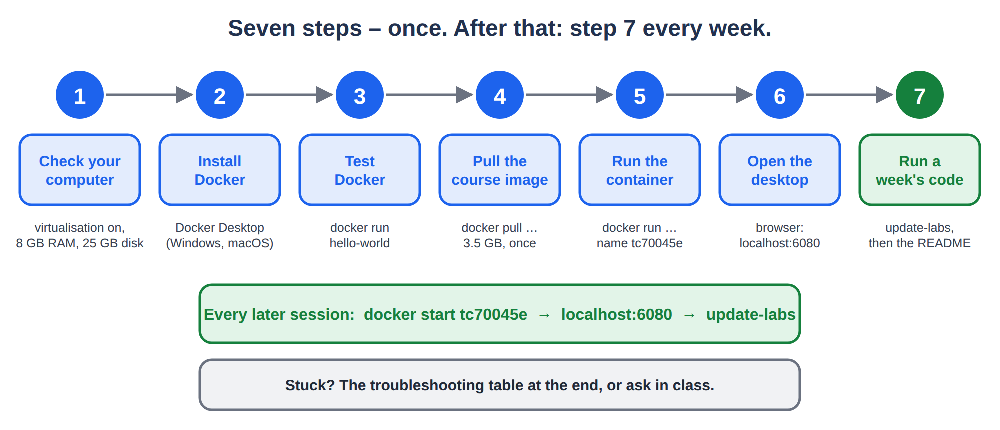
*Steps 1–6 once, at the start of the module. Step 7 every week.*

## Step 1 – Check your computer

You need a 64-bit computer with **8 GB of memory** (16 GB is better) and **25 GB of free disk**. No special graphics card.

**Windows:** check that virtualisation is enabled (picture). If it says *Disabled*, turn on *Intel VT-x* or *AMD-V / SVM* in the BIOS/UEFI settings (search the web for your laptop model + "enable virtualization"), or ask for help in class.

**Mac with Apple silicon (M1–M4):** the image is built for Intel/AMD processors and runs slowly under emulation. If Gazebo is too slow, use a rented computer instead: [docs/RUN_ON_VAST.md](RUN_ON_VAST.md).

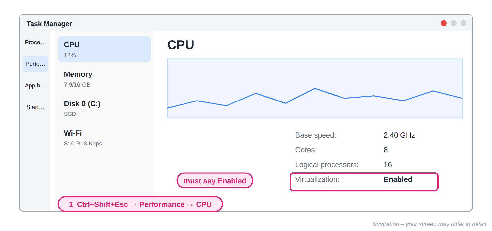
*Windows: Task Manager (Ctrl+Shift+Esc) → Performance → CPU → "Virtualization: Enabled".*

## Step 2a – Windows: install WSL 2

Docker on Windows runs Linux programs through **WSL 2** (Windows Subsystem for Linux).

Right-click the **Start** button → **Terminal (Admin)** (or *Windows PowerShell (Admin)*), type the commands in the picture and **restart** the computer when asked. `wsl --status` must say *Default Version: 2*.

Already have WSL? Just run `wsl --update`.

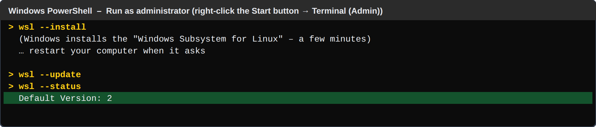
*Windows Terminal or PowerShell, opened as administrator.*

## Step 2b – Windows: install Docker Desktop

Open **docs.docker.com/desktop/setup/install/windows-install** in your browser and click **Docker Desktop for Windows – x86_64** (blue button). Run the downloaded *Docker Desktop Installer.exe*.

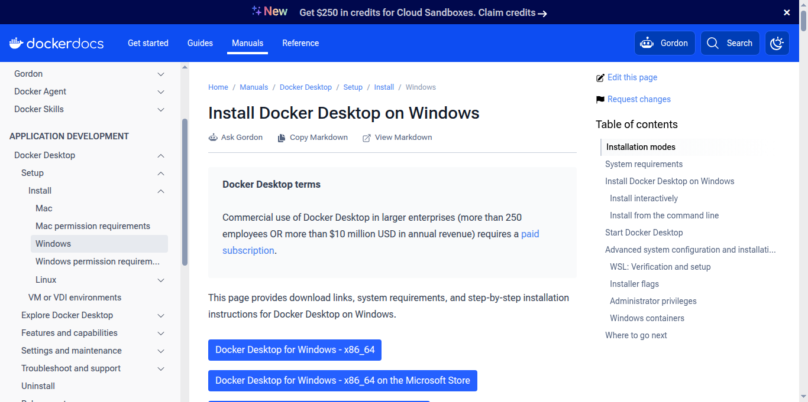
*docs.docker.com → Install Docker Desktop on Windows: click "Docker Desktop for Windows – x86_64".*

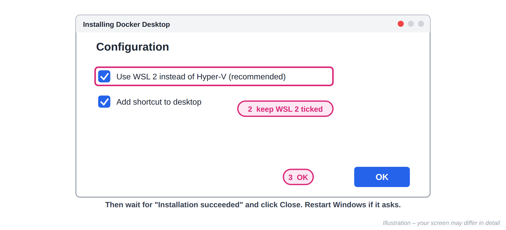
*Keep "Use WSL 2 instead of Hyper-V" ticked, click OK, wait, Close.*

## Step 2c – Windows: start Docker Desktop

Start **Docker Desktop** from the Start menu. Accept the agreement, then **Skip** the sign-in and the survey. Wait until the bottom-left corner says **Engine running**.

Docker Desktop must be running every time you use the course container.

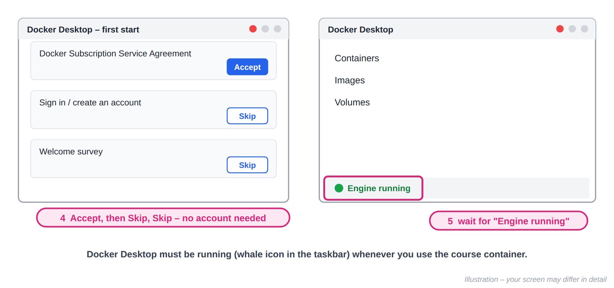
*Accept the agreement; you do not need a Docker account (Skip).*

## Step 2 – macOS and Linux

**macOS:** download Docker Desktop from **docs.docker.com/desktop/setup/install/mac-install** – choose *Apple silicon* or *Intel chip* (Apple menu → About This Mac tells you which). Drag Docker to Applications, open it, accept, Skip sign-in, wait for *Engine running*.

**Linux (Ubuntu):** install Docker Engine with the commands below, then **log out and in again**.

```bash
curl -fsSL https://get.docker.com | sudo sh
sudo usermod -aG docker $USER      # then log out and log in again
```

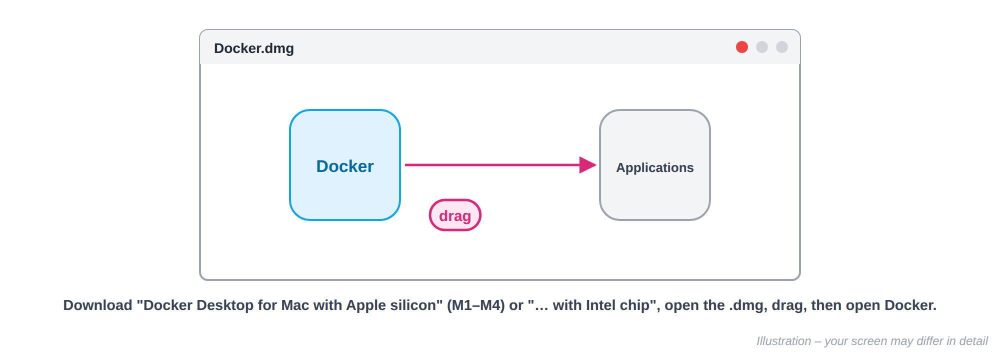
*macOS: open the .dmg and drag Docker to Applications, then open Docker from Applications.*

## Step 3 – Test Docker

Open a terminal on **your computer**: Windows **PowerShell** (Start → type *PowerShell*), macOS **Terminal**, Linux **Terminal**. Type:

```bash
docker --version
docker run hello-world
```

> "docker is not recognized" or "cannot connect to the Docker daemon": Docker Desktop is not running – start it and wait for Engine running.

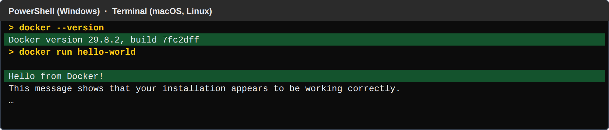
*Real output. The two highlighted lines are what you are looking for.*

## Step 4 – Download (pull) the course image

In the same terminal:

```bash
docker pull abdulmannan617/tc70045e-ros2:humble
```

> The first time this downloads **3.5 GB** (10–20 minutes on a good connection). It ends with *Status: Downloaded newer image…* or *Image is up to date*. If the connection breaks, run the same command again – it continues.

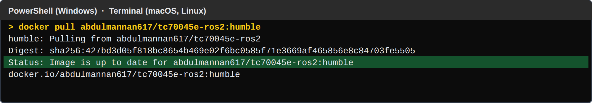
*Real output when the image is already up to date. The first time you see a list of layers downloading.*

## Step 5 – Start the course container (once)

Copy and paste this **one line** into the terminal (it is the same on Windows, macOS and Linux):

```bash
docker run -d --name tc70045e -p 6080:80 --shm-size 2g --security-opt seccomp=unconfined -v tc70045e_work:/home/ubuntu/work abdulmannan617/tc70045e-ros2:humble
```

> Do this **once**. It creates the container **tc70045e**. Later you only **start** it again (Step 7). Check with `docker ps`: the line with *tc70045e* must say *Up*.

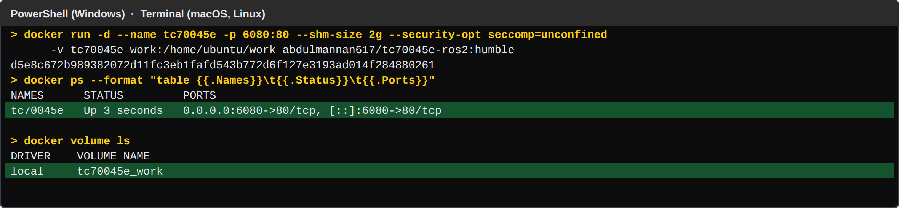
*Real output: a long container number, then the container tc70045e is Up, and your work volume exists.*

## Step 6 – Open the desktop in your browser

Open **http://localhost:6080** in Chrome, Edge, Firefox or Safari and click **Connect**. Wait up to 30 seconds after Step 5.

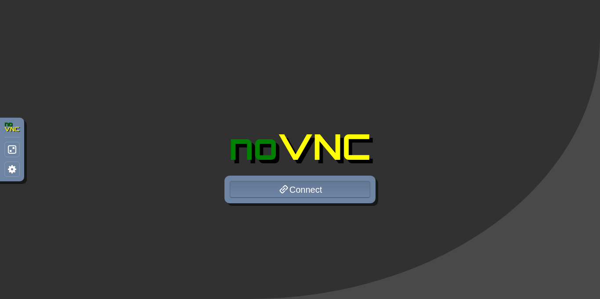
*http://localhost:6080 – click Connect.*

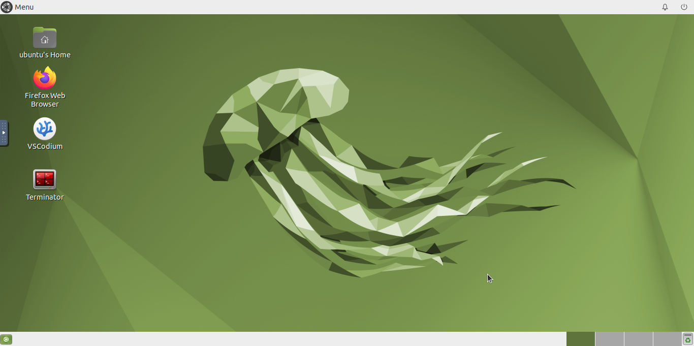
*The course desktop. If it asks for a password: ubuntu.*

## Step 6b – Check that the course is there

On the desktop, double-click **Terminator** (a terminal **inside** the container). Type `ls ~/labs` and `ls ~/labs/week02`.

You must see **week01 … week12**. If not, see *No week folders* in the troubleshooting table.

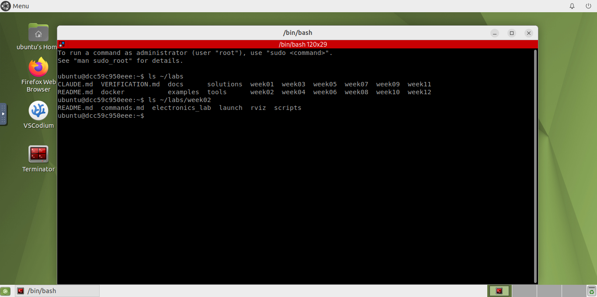
*Double-click Terminator. ls ~/labs lists week01 … week12; ls ~/labs/week02 lists launch, rviz, scripts.*

## Step 7 – Every session: start, open, update-labs

1. Start Docker Desktop. 2. `docker start tc70045e` (or the ▶ button in Docker Desktop → Containers). 3. Open **http://localhost:6080**. 4. In Terminator type **`update-labs`** – it downloads the new week's files (a few MB) and never overwrites a file you changed.

Finished? `docker stop tc70045e` (or ■). Your files stay inside the container.

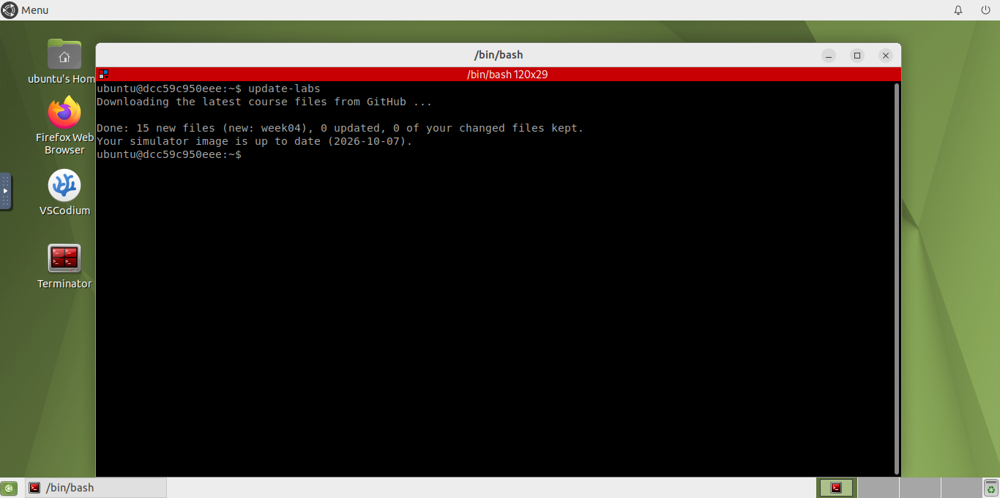
*update-labs fetched the new week (here week04) and kept your own changes.*

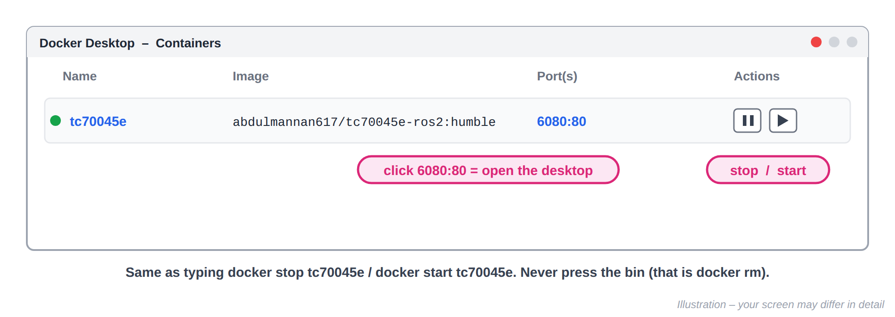
*Starting and stopping from Docker Desktop is the same as docker start / docker stop.*

## Step 7b – Run a week's code

Open the week's **README** on GitHub (github.com/abdul-mannan-khan/TC70045E-robotics-sim → weekNN) or in the desktop (`~/labs/weekNN/README.md`). Copy each command into the terminal it names (T1, T2, T3).

Split Terminator: **Ctrl+Shift+O** (one above the other) or **Ctrl+Shift+E** (side by side). Stop a program: **Ctrl+C**. Paste into the desktop: **Ctrl+Shift+V**, or use the clipboard in the noVNC side panel.

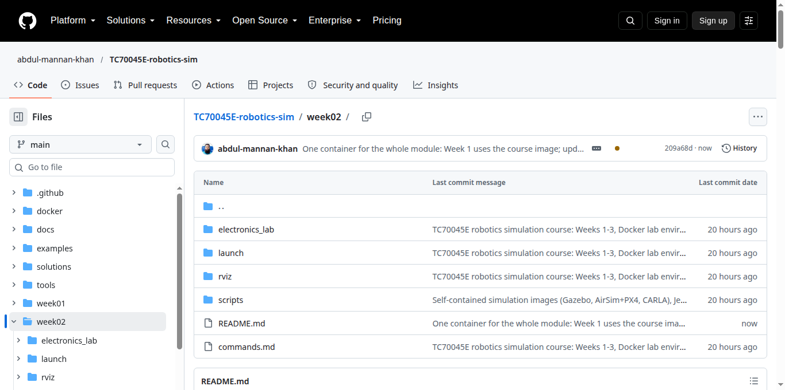
*Each week's README on GitHub has the exact commands. Here: week02.*

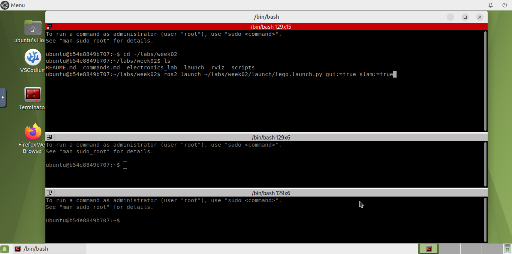
*Terminator split into T1, T2, T3 (Ctrl+Shift+O). T1: the Week 2 launch command.*

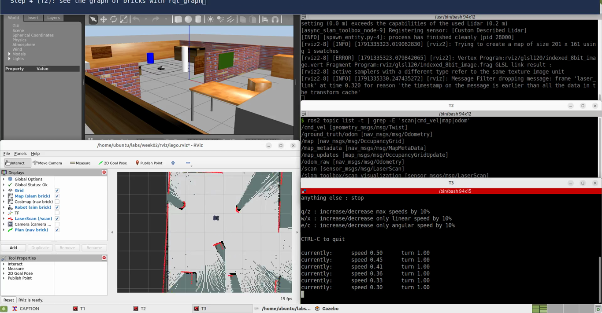
*The result: Gazebo (the simulated lab, top left) and RViz (what the robot knows, bottom left).*

## Where your files live

**~/labs** – the course (refreshed by `update-labs`). You may edit there; `docker stop`/`docker start` keep it.

**~/work** – **your** folder. It is a Docker volume on your computer: it survives `docker rm` and new images. Keep reports, maps, recordings and copies of your solutions here.

Never click the bin icon / `docker rm` unless a step tells you to – then copy your work to ~/work first.

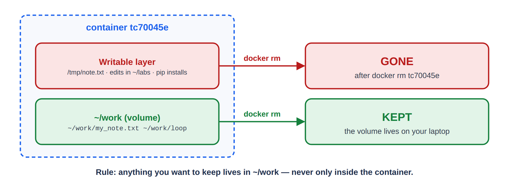
*Files in ~/work survive anything; other files survive stop/start but not docker rm.*

## Only if update-labs asks: a new image

Sometimes the simulator itself changes. Then `update-labs` prints *This week also needs a newer simulator image*. Copy your work into ~/work, then on **your computer** (PowerShell / Terminal):

```bash
docker pull abdulmannan617/tc70045e-ros2:humble
docker rm -f tc70045e
docker run -d --name tc70045e -p 6080:80 --shm-size 2g --security-opt seccomp=unconfined -v tc70045e_work:/home/ubuntu/work abdulmannan617/tc70045e-ros2:humble
```

> The last line is Step 5 again. ~/work comes back unchanged.

## Troubleshooting

| Problem | Fix |
|---|---|
| No `~/labs`, or no week folders in it | Old or wrong image (for example *tiryoh/ros2-desktop-vnc*, or a container from Week 1 of an earlier version). Copy your work to ~/work, then do *Only if update-labs asks* above. A single week missing: `update-labs`. |
| `docker: command not found` / *not recognized* | Docker Desktop is not installed or not running (Step 2). |
| *Cannot connect to the Docker daemon* | Start Docker Desktop and wait for *Engine running*. Linux: `sudo systemctl start docker`. |
| *WSL update required* / *WSL 2 installation is incomplete* | `wsl --update` in PowerShell (admin), restart Docker Desktop. |
| *Virtualization not enabled* | Enable Intel VT-x / AMD-V (SVM) in the BIOS/UEFI (Step 1). |
| *Conflict. The container name "/tc70045e" is already in use* | You already have it: `docker start tc70045e` instead of `docker run`. |
| *port is already allocated* (6080) | Another program uses 6080: change `-p 6080:80` to `-p 6081:80` and open localhost:6081. |
| Blank or grey page at localhost:6080 | Wait 30 s and reload. Is it running? `docker ps`. Log: `docker logs tc70045e`. |
| *permission denied* (Linux) | `sudo usermod -aG docker $USER`, log out and in. |
| Very slow, Gazebo freezes | Close other programs; Docker Desktop → Settings → Resources (memory). Or use Vast.ai: docs/RUN_ON_VAST.md. |
| Disk full | `docker system df`, then `docker image prune` (removes old images you no longer use). |

Rented computer instead of your own: [RUN_ON_VAST.md](RUN_ON_VAST.md). More options (GPU images, docker compose): [RUN_LOCALLY.md](RUN_LOCALLY.md).
